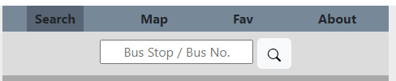
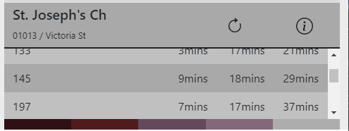
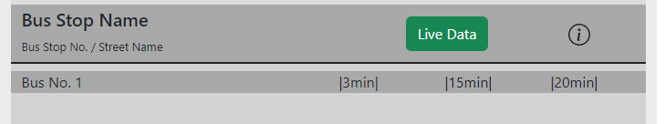
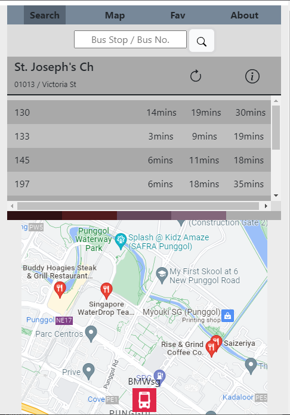

A README.md file with explanations of the technologies used, the approach taken, a link to your live site, installation instructions, unsolved problems, etc.


# BMWsg - Bus Arrival Timing App

This is my attempt at making your life better if you own a BMW (Bus, MRT, Walk) in Singapore.

This app fetches the bus arrival timings of all the buses at a bus stop.

Try it out, search a bus stop number at https://bobbestben.github.io/

No installation required, this appliation uses the source HTML, CSS and JS files only.

## Features of the app

### Interactive Nav bar



Pages *within* a page, hover and *current page selection* effects

Main idea is assigning a unique `class` to the currently selected page.

```HTML
### HTML
<div class="active" data-tab-target=".home-page">Search</div>
<div data-tab-target=".map-page">Map</div>

<section class="home-page active" data-tab-content>
<section class="map-page p-2 text-center" data-tab-content>
```

Here I'm using data attribute to assign which content sections (`data-tab-content`) belong to which page (`data-tab-target`). 

```JS
### CSS
[data-tab-content] { 
    display: none; 
}

.active[data-tab-content] {
    display: block;
}
```
Adding a `class` to selected page ``onclick``

```js
### Javascript
tab.onclick = function() { ...

    target.classList.add('active')
    tab.classList.add('active')

... }
```

### Search Functionality with Error Handling

Currently can only search for bus stop number.

Error handling - throws error message if incorrect bus stop number is searched.

CORS Proxy is required - currently using *cors-anywhere* proxy, need to request access [here](https://cors-anywhere.herokuapp.com/corsdemo) each time app is initialized

```js
### Updating query parameter based on search input
let busArrivalUrl = "https://cors-anywhere.herokuapp.com/
                        http://datamall2.mytransport.sg/
                            ltaodataservice/BusArrivalv2?BusStopCode="

busArrivalUrl += input.value

### Fetching data from API - Proxy Used, AuthKey in Headers
fetch(busArrivalUrl, {
    method: 'GET',
    headers: {
       'AccountKey': 'c5SCu1KNQ4OsnpfU+wxoyg=='
    }
})
    .then(response => {
        return response.json()
    })

```

Searching for bus number not yet as requires modififying the data structure of the API data.


### Bus Stop Info Section 

Update `bus-stop-info` and `bus-arrival-timings` using the API data.

Everything is formatted mainly using **Bootstrap's flexbox** and **grid system**. Icons also from bootstrap.

```html
### Sample div that will be appended from JS after searching bus stop
<div class="row flex-nowrap bus-arrival-section">
    <div class="col-6">Bus No. 1</div>
    <div class="col">|3min|</div>
    <div class="col">|15min|</div>
    <div class="col">|20min|</div>
</div>
```
```js
### Algorithm - Nested Loop in JS
const updateBusTiming = () => {

    //First Loop - for each bus at bus stop
    ///Second Loop - for each arrival timing for each bus
    const futureTime = new Date(dataBusArrival['Services'][j][nextBusKeys[k]]['EstimatedArrival'])

}

### Time and Date in JS
const busArrivalTiming = "2022-06-30T12:11:16+08:00" //Common time format from API

const currentTime = new Date() // "Fri Jul 01 2022 04:59:34 GMT+0800 (Singapore Standard Time)"`

const futureTime = new Date(busArrivalTiming)

const minsToArrival = Math.floor((futureTime - currentTime) / (1000*60))
```

### Refresh Button
Re-used same function as my `searchBtn`, just need to store the search value
```js
searchBtn.onclick = function() {
    updateBusTiming()
}

refreshBtn.onclick = function() {
    input.value = storeSearchValue
    updateBusTiming()
}
```

### Tooltip

Designed using CSS:
- Design 2 shapes - a Tooltip box, and Triangle
- Position it to the left `left: 2.5rem` and `transform: translateX() translate Y()`
- set `scale: 0`
- on `:hover`, set `scale: 1`
- play with animation - `transition` and `transform-origin`

### Scrollable div - pseudo sticky nav

I made the container scrollable within the page using:
- Bootstrap's `overflow-auto` to contain the content
- within viewport height of `calc(100vh - 240px)`



Sticky nav works. But if I do so, I would need to make `search-bar` and `bus-stop-info` sticky as well. This *might* affect other pages if I don't want those content to be sticky.

### Future Improvements

1. Bus Stop timings - Make it live feed, like the otter in TraceTogether, so user don't need to click refresh

    


2. Search Page - I want to put a real time map of
   - User Location
   - Bus Stop locations
   - Interactive map - provides info when icons are clicked
  
    

3. Favourites page - explore local cache/storing/saving of favourite bus stops


